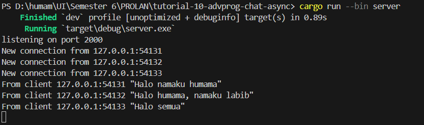
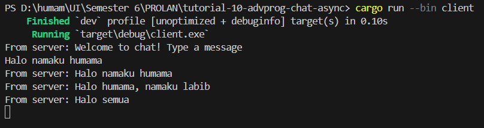
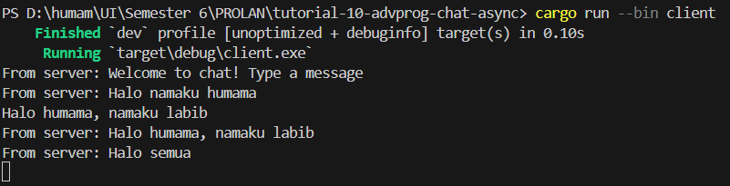
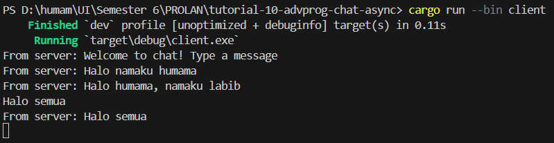

# tutorial-10-adpro-chat

## Reflection
### Experiment 2.1

#### Server

#### Client 1

#### Client 2

#### Client 3

### Experiment 2.2
In the tutorial, we modified the client file to connect to the endpoint with port 8080. Since we are going to connect to port 8080, we need to make sure that the server listens to that port as well. We modified the `TcpListener::bind` associated function to take a `String` argument that represents the endpoint with port 8080. This tells the server to bind to the endpoint with port 8080 before listening to it. Since we only modified the port, the protocol remains unchanged. Thus, we are still using WebSocket protocol for our chat program.